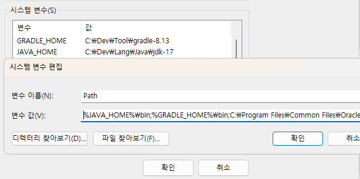
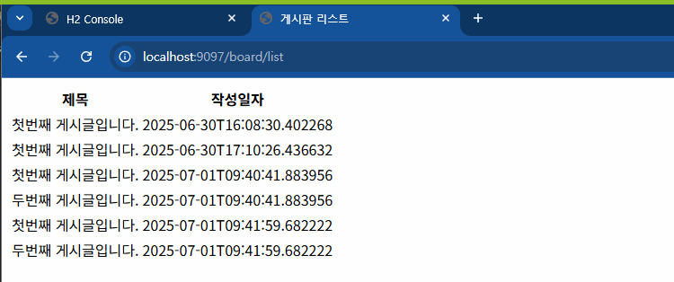
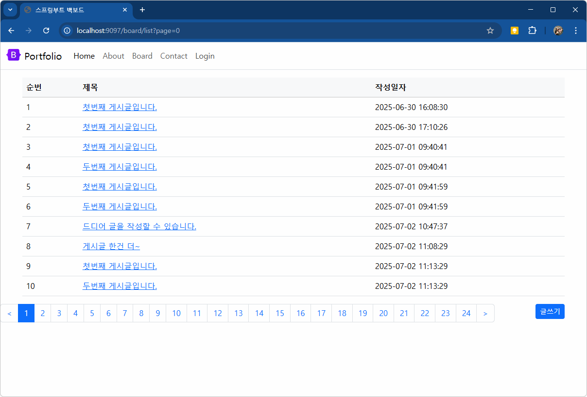
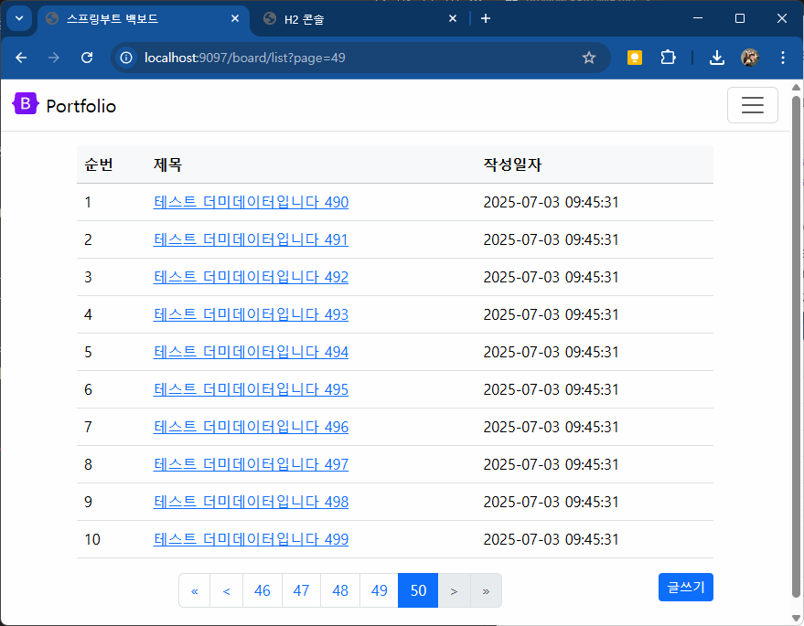
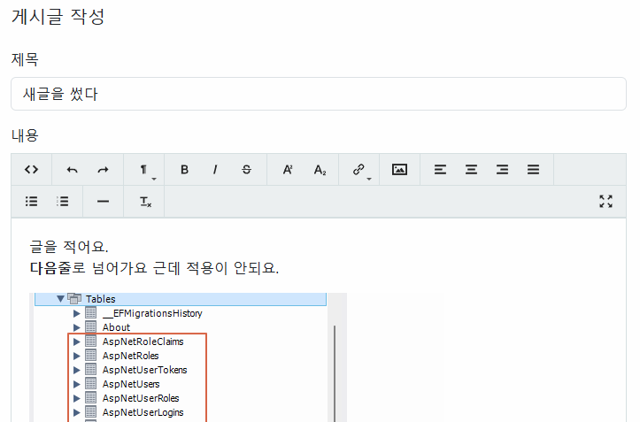

###### 20250401 April fool's day 푸하하 근데 안웃김 ㅡㅡ

    > Java랑 Springboot 첫날 !!! 명건쌤이랑!!!

# java-springboot-2025

2025년 PKNU Java 개발자과정 SpringBoot 리포지토리 !!

### 20250401 첫수업 !! 음 ..전체적으로는 한 38..일..?

## 1일차

### 웹 개요

> 이론을 너무 몰라도 안 된대!! 기본적인 개념은 숙지해두자~

- 구성 3단계
  - 브라우저 (클라이언트/프론트엔드) : 사용자가 **요청**을 하고, 그 결과를 돌려 받는 파트
  - 서버(백엔드) : 사용자의 요청을 받아서 DB에서 데이터를 가져와 처리하고, 사용자에게 **응답**하는 파트
  - 데이터베이스 - 가장 중요한 데이터가 저장되어 있는 파트 !!
    > 요청을 하고, 응답을 받는 과정이 중요함 !!

### Spring Boot 개요

- Java : 컴퓨팅 세상 모든 곳에서 사용될 수 있는 언어가 되고자 개발됨
- 웹개발

  1. CGI(Common GateWay Interface) - HTTP 프로토콜에서 정적인 데이터만 전달할 수 있는 웹기술
  2. Servlet - CGI를 개선한 Java 웹기술. 동적웹을 개발할 수 있음
     - HTML 코드를 전부 Java에서 작성해야 함 (완전 어렵대)
  3. EJB(Enterprise Java Bean) - 서블릿으로 대형 프로젝트를 개발할 수 있는 Java 웹기술
     - **무 지 하 게** 복잡.
       > 위의 방법들은 다 좀 불편했대~
  4. JSP(Java Server Page) - 자바 코드와 웹페이지 코드를 분리하여 개발할 수 있는 Java 웹기술
     - 확장자가 .jsp / 스파게티 코드 ; 웹페이지와 자바코드가 섞여 있어 분리하기 어려움!!
  5. Spring -Java 웹개발의 전성기. ; 웹개발에 봄이 왔대~ 🌸
     - 웹페이지와 자바 영역 분리
     - _그치만 설정이 복잡._
  6. Spring Boot - Spring의 단점을 최소화. 설정을 간결화.

- Spring Boot

  - Spring 기술을 그대로 사용(마이그레이션이 간단)
  - JPA 기술을 사용하면 ERD나 DB설계를 하지 않고도 손쉽게 DB를 생성. DB 연동도 쉬움!
  - Tomcat Webserver가 내장! (설치 필요 없음 !)
  - 서포트하는 기능 다수 존재(개발을 쉽게 도와줌!)
    > 테스트용 JUnit, 로그용 Log4J2 모두 포함 ; 설치 필요 없음 !
  - 프론트엔드를 다양하게 지원. JSP, **Thymeleaf** , Mustache 등
  - React, View.js 등의 자바스크립트 프론트엔드와 연계해서 풀스택 개발 가능
  - MVC(Model, View, Controller)로 영역을 분리. 각 부분별로 따로 개발

- MVC

  - View는 JSP 포함, Thymeleaf, Mustach, HTML 등등
    
    > 사용자가 웹브라우저에서 요청하면, Controller에서 그 요청을 받아 Model에 요청하고, Model이 DB에서 정보를 가져와 다시 Controller에 갖다 주면 그걸 View가 받아서 사용자에게 전달해 줌 !!

  > \*웹이란 ?

        인터넷에서 사용자의 요청(request)에 대한 서버의 응답(response)입니다 ~!*

### Spring Boot 개발환경 설정

- 필요 요소

  - Java, 개발툴, 데이터베이스

- Java

  - Java Runtime과 JDK(Java Developer Kit) 존재
    - Oracle 외에도 OpenJDK가 산재 !!
    - https://www.azul.com/downloads/?package=jdk#zulu
    - https://adoptium.net/
    - https://jdk.java.net/
  - Java 17버전 이상 설치 !!
    - https://www.oracle.com/kr/java/technologies/downloads/
    - jdk-17.0.13_windows-x64_bin.msi 다운로드

  > 설치할 때 경로를 생각해서 관리하자 !! ; 나중을 대비하는 것임~

      ; C\Dev\Lang\Java\jdk-17

  - 시스템정보(sysdm.cpl) 고급 > 환경변수 Path 설정
    - 새로만들기
      - JAVA_HOME
    - Path에 %JAVA_HOME%\bin 추가, 맨 위로 보내기 ; 그래야 제일 상위로 실행 됨 !!
  - powershell
    - java --version으로 확인 ; 17.0.13 LTS

- Visual Studio Code ; 무료예요~ ^^
  - 확장 설치 !! ; Java 검색
    - Extension Pack for Java 설치. Debuger for Java 등 총 7가지 확장 설치

### Java 기본 실행

- VS Code에서 명령팔레트 실행(Ctrl + Shift + p)
  - Java create
  1. build tool > Maven
  2. No ArchType 선택
  3. Group ID 입력(com.example)
  4. Artifact ID 입력(demo)
  5. 저장위치 결정

### Spring Boot 설정

- Visual Studio Code 확장 설치
  - Spring 검색
    - Spring Boot Extension Pack 설치 (추가 3개 확장 같이 설치됨 !!)
  - Gradle 검색
    - Gradle for Java 설치

### Spring Boot 기본 실행(Java 프로젝트)

- JDK 버전과 Spring Boot Initializr에 선택하는 JDK 버전이 일치해야 함 !!!

  - OS에 JDK버전이 **17버전이면 17버전 선택** !!!

- VS Code에서 명령팔레트 실행

  - Spring initializr : Create a Maven Project 선택
  - Specify Spring Boot version: 3.3.10 선택
    > SNAPSHOT은 개발 중간 버전이래 !! / M2&M3가 안정된 버전.
  - Specify project language : Java
  - Input Group Id : 본인 아이디 입력 ; 하고 싶은 거 입력!! ; 폴더 이름이 될 것!!
  - Input Artifact Id : spring01
  - Specify packaging type : Jar(Java archive, 압축파일)
  - Specify Java version : 17
  - Choose dependencies : Selected 0 dependencies
  - 저장위치 선택
  - **새 창 열기** -Spring Boot 프로젝트가 루트 폴더가 된 개발환경
    > 실행은 spring boot dashboard에서 진행하는 게 좋다 !

- 실행방법

  - 코드 작성
  - Spring Boot Dashboard > Apps > 앱 실행(Run)

- 기초문법
  - [JAVA기초문법](./JAVA_BASIC.md)
    > cf ) TIOBE : 컴퓨터 언어가 쓰이는 순위통계
  - 기본, 변수, 자료형, 연산산자, 흐름제어,

#### 20250402 Java, Spring boot 2일차 !!!! 총 43번째 수업이더라 헉!!!!!!!!!!! ㅇ0ㅇ

## 2일차

- 기초 문법 계속 !!
  - [JAVA기초문법](./JAVA_BASIC.md)
  - 흐름제어(반복문), 배열, 메서드, 객체/클래스, 상속

## 3일차

- 기초 문법 계속 !!!
  - [JAVA기초문법](./JAVA_BASIC.md)
  - 상속, 인터페이스, 예외처리, 제네릭, 컬렉션 프레임워크, 입출력

### Spring Boot Build Tool

- 개요

  - 프로젝트 빌드 과정을 자동화시켜주는 도구 !!
  - 컴파일, 테스트, 패키징, 의존성 관리, 배포 등등 포함

- Maven

  1. Java 프로젝트 기본 빌드 도구
  2. Maven Repository, https://mvnrepository.com/ 검색 가능
  3. 빌드, 패키징(jar/war 파일 생성), 테스트 등을 한번의 명령으로 간편하게 처리
  4. **가장 큰 특징** : 외부 라이브러리 자동으로 다운로드 및 관리
  5. pom.xml(Project Object Model) 파일로 빌드 설정을 관리
     - 초기설정시 빠졌거나, 추가되어야 하면 xml 코딩으로 추가
  6. Vs Code 확장 중 Maven Dependency Explorer 등으로 확인

- Gradle

  1. 안드로이드용 오픈소스 빌드 도구
     > 장점을 결합해서 만들었대 !!
  2. Maven Repository를 같이 사용 !
  3. Maven의 3, 4번 특징을 그대로 가지고 있음 !
  4. build.gradle 파일 사용. Groovy 스크립트 지원
  5. 빌드 과정을 병렬처리, 캐싱사용으로 Maven보다 10~100배 정도 향상된 성능을 가짐!

  > 회사에서 Maven을 쓸지, Gradle을 쓸지 모른대~ 둘 다 잘 알아놓자 !

### Gradle 설정

- **Gradle로 프로젝트가 제대로 동작하지 않을 때 !!! 참고 !!!!**
  - https://gradle.org/ 에서 gradle 다운로드
  - 설치 경로 확인, 설치
  - 시스템 등록정보 PATH 지정. GRADLE_HOME 사용

### Spring Boot 로그 설정

- Spring Boot를 colorizing 해주는 기능
- src/resources/application.properties

  ```shell
  spring.output.ansi.enabled=always
  ```

- 서버 재시작

## 4일차

- 기초문법 마무리

  - [JAVA기초문법](./JAVA_BASIC.md)
  - 제네릭, 컬렉션 프레임워크, 입출력, 람다식, 스트림API

- Spring Boot 시작
- Gradle 오류 해결방법

  - [Gradle](https://gradle.org/install/)
  - C:\Gradle 위치에 압축해제 ; binary only 받을 것 !!
  - sysdm.cpl 환경변수 GRADLE_HOME 경로 입력, 확인(JAVA_HOME과 동일)
    

  - VS Code 설정

    

  - Gradle Build Server : Enabled 기본 On -> Off
    

  - Gradle Home -> 환경변수 입력한 GRADLE_HOME의 경로 입력
  - Gradle Java Home -> 환경변수 JAVA_HOME의 경로 입력 !!!!

  - VS Code 재시작 !!

#### 20250407 Java Sprint Boot 5번째 수업!!! 벌써 5번째 수업이라고?? 말도 안 돼 !!!(irony)

## 5일차

- Spring Boot 웹 실행 !

  - Spring initializr : Create a Gradle Project 선택
  - Specify Spring Boot version: 3.4.4 선택
    > SNAPSHOT은 개발 중간 버전이래 !! / M2&M3가 안정된 버전.
  - Specify project language : Java
  - Input Group Id : 본인 아이디 입력 ; 하고 싶은 거 입력!! ; 폴더 이름이 될 것!!
  - Input Artifact Id : spring03
  - Specify packaging type : Jar(Java archive, 압축파일)
  - Specify Java version : 17
  - Choose dependencies : Selected 1 dependencies
    - Spring Web
  - 저장위치 선택
  - **새 창 열기** -Spring Boot 프로젝트가 루트 폴더가 된 개발환경
    > 실행은 spring boot dashboard에서 진행하는 게 좋다 !

- 기본 설정

  - application.properties에 `spring.output.ansi.enabled=ALWAYS` 추가!!
    > 밑의 로그의 글자에 색이 입혀짐 !!

  > cf) 

- 포트 번호
  | 프로토콜 | 포트번호 | 비고 |
  | :---|---:|:---|
  |HTTP|80|웹 서버, 서비스 포트(보안 취약 !)|
  |HTTPS|443|SSL를 적용한 웹 서비스(보안 강화 !)|
  |FTP|21|웹을 통한 파일전송|
  |TELNET|23|원격서버접속|
  |SSH|22|보안강화된 텔넷|
  |SMPTP|25|메일 전송서비스|

  > 웬만하면 80 포트는 쓰지 말자 !! (보안에~ 취약하니까~)

- 개발용 포트 !!

  > cf) 8080 포트 // Oracle은 1521 였잖아~ 기억나지 ?

  - 포트는 중복 안 됨 !
  - 8080 포트를 사용하고 있으면 다른 포트로 변경해야 함 !!
  - 포트 변경 시 application.properties에 `server.port=8090`

- 웹브라우저 열기

  - http://localhost:8090/ 오픈 !

    

- 접속위치 요청 처리

  - 컨트롤러 생성

    - HelloController(우클릭 - New java file - class로 생성)
    - http://localhost:8090/hello

  - 각 기능별로 패키지를 구분
    - controller, model 등 ..

### 로그 출력

- Log-back

  - 스프링부트에 내장된 로그 모듈

  - application.properties 내 로그 설정

  ```groovy
  logging.level.root = info
  logging.file.name = /logtest.log
  ```

  ```java
  // 클래스 내 작성
  private final Logger logger = LoggerFactory.getLogger(this.getClass());

  // 메서드 내 사용 !
  logger.info("Hello URL 오픈 !"); // 로그를 남김 !!

  // 문제 발생 시 로그를 남길 때 !
  logger.debug("디버그 시 필요한 로그입니다 .");
  logger.trace("디버그 시 필요한 로그입니다 !");

  logger.warn("경고가 표시될 시 나타나는 로그입니다 !!");
  logger.error("에러가 발생했을 시 나타나는 로그입니다 !!!");
  ```

- **Log4J2 외부모듈 사용 권장 !!!**

### 스프링부터 배너(중요도 없음~ ^^ )

- resources 폴더에 banner.txt 생성 !
- 내용 추가
- [Spring Boot Banner Generator](https://devops.datenkollektiv.de/banner.txt/index.html)
- 배너 제너레이터로 생성한 글자 복사해서 banner.txt에 붙여넣기 !
- 서버 재시작 ^\_^


### 메인페이지 추가

- resources/static/index.html 부터 시작 !

### 스프링부트 프로젝트 구조


- 각 폴더 구조
  - .gradle ~ gradle : 그레이들, VSCode, 빌드 등에 필요한 폴더 (설명 필요 X)
  - `src/main/java` : 패키지와 자바 소스가 저장되는 위치
  - com.bbit808.spring03 : 패키지. 폴더로 구성
    - Hellocontroller 클래스에 접근하려면
    - com.bbit808.spring03.controller.Hellocontroller 접근해야 함 !!
  - Spring03Application.java : 시작프로그램
  - src/main/resources : 자바파일 이외 HTML, CSS, JS, 환경파일 등 리소스파일 저장되는 위치 !
    - `static` : CSS, JS, 이미지 파일 저장되는 곳
    - `template` : 스프링부트와 연계되는 HTML 파일 저장되는 곳 !
    - `application.properties` : 프로젝트 환경설정 파일. 환경변수, DB 설정
  - src/test/java : JUnit 스프링부트 테스트도구 자바파링 저장되는 위치
  - `build.gradle` : 그레이들 환경 파일. Groovy 기반으로 한 빌드 도구. dependencies만 잘 구성하면 됨 !!!
  - gradlew.bat : 중간에 직접 그레이를 빌드할 때 사용하는 배치파일.
  - settings.gradel : 고급 그레이들 설정. _손댈 일 없음!_

### 스프링부터 어노테이션

#### @SpringBootApplication

- 스프링부트 자동구성 매커니즘 활성화
- 어플리케이션 내 패키지에서 컴포넌트를 먼저 스캐닝 !
- 설정 클래스를 임포트해서 활성화, 스프링부트를 실행 !

#### @Controller

- 컴포넌트 구체화해서 해당 클래스 IoC 컨테이너에 Bean으로 등록 !

#### @GetMapping

- Get, Post 중 Get(URL)으로 들어오는 주소를 매핑, 처리해주는 역할
- @PostMapping, @RequestMapping 등 파악

#### @ResponsBody

- HTTP 요청의 자바객체가 처리한 body 내용을 매핑하는 역할
- 자바의 String 문자열을 웹페이지에 렌더링

## 6일차(6월 26일에 재개 ~!! 헉 ~!) ; 근데 오늘 2025년 06 30일이야! 하이! 다시 보니까 반갑다 ^ㅁ^ b

- Spring Boot JPA + Oracle + Thymeleaf + React

  - JPA - DB설계 없이 엔티티 클래스만으로 테이블을 자동 생성해주는 기술. SQL도 필요 없음 !!!!
    - JPA 이전 - MyBatis. SQL + XML로 구성된 ORM(Object Relational Mapping) 기술 !!
  - H2 - Oracle, MySQL 등과 달리 인메모리 DB. Spring Boot에서 자동으로 실행해주는 DB
    - 개발할 때 사용 ! 운영 시 이전할 때 DB 종류에 관계 없이 이전 가능 ! 개발 동안 사용!!
  - Thymeleaf - JSP 단점을 보안한 탬플릿 형태 FE 개발 방식 !
    - Bootstrap은 필수로 사용~
  - 소셜 로그인 ; 구글, 카카오, 네이버 SSO 로그인 연동(OAuth 2.0)
  - React ; FE(FrontEnd)를 완전 분리!

- Spring Boot 프로젝트 생성!

  1. 명령 팔레트로 시작!!(Ctrl + Shift + P) : Spring Initializr : Create a Gradle(Maven 보다 속도 쫌~ 더 빠름!) Project
     ; Spring Boot 버전이 높다고 다 좋은 것은 아님 !!

     1. Spring Boot version : 3.5.3
     2. project language : Java
     3. Group Id : com.pknu
     4. Artifact Id : backboard
     5. package type : Jar
     6. Java version : 17
     7. Dependency

     - Spring boot DevTools : 개발시 필요한 명령어, 기능 포함
     - Lombok(Developer Tools) : 어노테이션 등 편리하게 해주는 플러그인 라이브러리 !
     - Spring Web : 프론트앤드(html) 개발을 할 때 필요한 의존성
     - Thymeleaf(Template Engines) : html + Spring Boot 태그 매핑을 해주는 기능!
     - H2 Database(later) : 개발동안 필요한 인메모리 DB
     - Oracle Driver(later) : 실제 운영할 DB ; 오라클 운영할 때 Docker 켜주는 것 잊지 말기 !
     - Spring Data JPA(later) : DB 생성 + ORM

     8. 저장위치 지정, Generage into this folder 선택
     9. 오른쪽 하단 프로젝트 폴더 Open 버튼 클릭 !

  2. Spring Boot Backboard project

     - Gradle plugin -Dependency 파악 ! 프로젝트 업데이트 !!
     - Spring Boot dashboard - 프로젝트 실행!

  3. Spring Boot 설정파일
     - build.gradle = 그레이들에서 설정할 구성내용
     - application.properties - Spring Boot 프로젝트 자체 설정파일
     - setting.gradle, gradle-wrapper.properties ; 손 댈 일 없음 !!

### 스프링부터 Backboard 프로젝트

1. 기본 실행

   1. resource/application.properties

   ```config
   server.port = 9097  # 포트 변경!!
   spring.output.ansi.enabled=always  # 로그 색상 설정

   logging.level.root=info   # 로그 출력 레벨 설정
   logging.file.name=C:/temp/backboard.log   # 로그 파일 위치

   ```

   2. build.gradle

   ```gradle
   dependencies {
       // ... 생략 !

       // DB연동용 의존성
       runtimeOnly 'com.h2database: h2' // 개발 시에만 사용하는 InmemoryDB H2 ; 데이터베이스가 쓰는 것에 따라 바뀐대!!(자동으로)
       implementation 'org.springframework.boot:spring-boot-starter-data-jpa' // 버전은 굳이 적을 필요는 없대~
   }

   ```

   3. Controller 작업

      - MainController 생성
      - 새 파일로 생성 or Menu Java New file > class 둘 다 동일 !

   4. /resources/templates/ 에 Mapping 메서드 리턴값과 동일한 html을 작성!

2. DB 연동

   1. H2 DB 의존성 추가
   2. application.properties에 H2 관련 설정 추가

      ```properties ## H2 DB 설정
      spring.h2.console.enabled=true
      # 접속 URL ; 뒤에 공백 안 넣게 조심 !!
      spring.h2.console.path=/h2-console
      # H2 DB 파일위치 : ~/ (user/Admin/ 에 생성) : ./ 현재 프로젝트 폴더에 생성
      spring.datasource.url=jdbc:h2:./local
      spring.datasource.driver-class-name=org.h2.Driver
      spring.datasource.username=sa
      spring.datasource.password=
      ```

   3. http://localhost:9097/h2-console 접속 !!


    4. application.properties에 JPA 설정

      ```properties
      ## JPA 설정
      spring.jpa.properties.hibernate.dialect=org.hibernate.dialect.H2Dialect
      spring.jpa.hibernate.ddl-auto=update
      ```

      -JPA 등의 ORM 작업 시 사용하는 기술 ; 하이버네이트
        - spring.jpa.hibernate.ddl.auto 종류 !
          - create : SB 서버 시작 시 테이블을모두 삭제 후 다시 재생성(데이터 모두 휘발!!! ㅇ0ㅇ)
          - create-drop : create와 동일 ! 서버가 종료되면 테이블 모두 삭제..
          <!-- - create-only : 잘 안 씀 !! -->
          - `update` : 엔티티 변경 부분만 적용. 원래 있던 데이터는 존재!
          - `validation` : 엔티티와 테이블 간 차이점 검사만
          - truncate : 데이터를 전부 날림 ㅇ0ㅇ !!
          - none : 엔티티가 변경되어도 DB는 변경하지 않음!!

    5. MVC 패턴에 맞춰 각 기능별로 패키지(폴더) 생성
          - controller, entity, service, repository...
          - templates 내 html

    6. @(Annotation) 정리
      - Lombok
          - `@Getter` : getter 매서드 자동 생성
          - `@Setter` : setter 매서드 자동 생성

      - JPA
          - `@Entity` : 테이블화 할 객체 선언!
          - @Id : 테이블 PK
          - @GeneratedValue(strategy = GenerationType.AUTO)
            - AUTO : JPA가 자동 선별 !! **사용 지양!!!**
            - `IDENTITY` : SQLServer Identity(1, 1), MySQL Auto-Increment
            - `SEQUENCE` : Oracle Sequence
            - H2 DB를 오라클 타입으로 사용하고, 나중에 운영 DB를 오라클로 갈아타자~

      - @Column : 컬럼의 속성을 변경 (ex : @Column(name="subject", length = 250))
            - name : DB 상의 실제 컬럼명을 엔티티와 다르게 사용할 때
            - length : 길이를 지정
            - updatable : 최초 작성 이후 수정 여부. false는 수정 불가
            - columnDefinition : "TEXT" MySQL, "CLOB" Oracle. H2는 사용 불가!
      - SpringFramework
            - @CreatedDate : 생성일
            - @LastModifiedDate : 최종수정일에 대한 어노테이션 !

    7. entity 패키지(폴더) 작성
        1. 테이블로 생성할 Board 클래스 생성
        2. Lombok @Getter/@Setter를 사용하면 Get~, Set~ 메서드를 작성할 필요 없음!!

    8. repository 패키지(폴더) 작성 !
        1. DB상의 데이터를 조회, 저장, 수정, 삭제할 수 있게 도와주는 인터페이스
        2. SELECT -> findAll(), INSERT -> save() 메서드를 기본 제공
        3. BoardRepository 인터페이스 생성

3. 단위테스트

   1. build.gradle에 JUnit 의존성 추가

      ```gradle
      // JUnit 단위테스트
      testImplementation 'org.junit.jupiter:junit-jupiter'
      ```

   2. INSERT 단위테스트
   3. test/ .../backboard/BackboardApplicationTests.java 에 단위테스트 메서드 작성 !!

   

   4. SELECT, SELECT ... WHERE 단위테스트
   5. 디버그콘솔에서 쿼리 로그로 확인. application.properties 설정 추가

      ```properties
      # 테스트 시 쿼리 확인
      spring.jpa.properties.hibernate.format_sql=true
      spring.jpa.properties.hibernate.show_sql=true

      ```

   6. SELECT ... WHERE LIKE, DELETE FROM 단위테스트

`````

## 7일차 (07-01)

### 스프링부트 Backboard 프로젝트(계속!!)

1. 단위 테스트
   - UPDATE 테스트

2. DB 연동 계발 계속

   1. Entity 중 Board(게시글)의 댓글 Reply 클래스 생성

   2. DB ERD에서 Board : Reply => 1:N(1대 다)의 관계를 가짐 !

   3. @(Anotation) 추가
      - @OneToMany(mappedBy = "board", cascade = CascadeType.REMOVE) : 1대다 ERD 관계로 부모클래스(테이블)에 작성하는 부분
      - @ManyToOne : 다대1 ERD 관계로 자식클래스에 작성하는 부분
      - @Service : 서비스 모듈을 지칭(SpringFramework)
      - @RequireArgsContructor : 생성자를 만들어 줌. 파라미터가 존재하는 생성자를 자동으로 생성(Lombok)
      - @AllArgsConstructor : 클래스 멤버변수를 사용해서 생성자를 만들어주는 것(Lombok)
      - @NoArgsContructor : 파라미터(클래스 멤버 변수) 없는 빈생성자를 자동으로 생성(Lombok)

   4. ReplyRepository 인터페이스 작성!

   5. Service 작성
      - 데이터 처리를 위해서 작성하는 클래스. MVC/패턴 처럼 모듈화로 복잡한 코드를 단순화, 역할 분리를 위해서
      - Controller는 게이트(문) 사용자가 접속해서 요청하는 부분

   6. 엔티티를 DTO 객체 변환
      - Entity : DB와 연결되어 있는 클래스. 이 객체를 그대로 사용해서 FE로 보내는 방식이 좋지 않음
      - Dto 사용은 옵션으로 할 수도 있음

   7. BoardController 작성

   8. /templates/board_list.html 작성
      - thymeleaf 문법 적용

      

   9. 상세 페이지 작업
      - Service, Controller 메서드 작업

   10. 상세 페이지에 댓글 저장 기능 추가
       - board_detail.html에 댓글 저장 폼양식 추가
       - ReplyService, ReplyController 각각 생성, 작성

3. thymeleaf 문법

   - ${} : 변수표현식. 변수에 들어있는 값을 화면에 표시하는 기능. Model에 들어있는 데이터를 화면에 표시
   - @{} : URL 링크 표현식. 정적인 링크 또는 라우팅되는 경로를 생성하는 기능
   - #{} : 메세지 표현식
   - *{} : 선택변수 표현식. th:object로 선택된 객체 내의 값에 접근
   - ~{} : Fragment 포함 표현식. 템플릿 Fragement를 사용
   - thymeleaf 속성에만 사용 가능 : th:text, th:href ..

4. 웹 페이지 디자인
   1. resources/static : css, js, 정적html 파일들이 위치
   2. static/main.css : 전체에서 사용할 css 파일
   3. Bootstrap 적용
      - https://getbootstrap.com Current v5.3.7 download 클릭
      - https://github.com/twbs/icons/releases/tag/v.1.13.1
   4. board_detail.html : 부트스트랩 적용

5. 전체 HTML에 디자인 적용
   1. build.gradle에 thymeleaf-layout 의존성 추가
    ```gradle
   // Thymeleaf layout 의존성 추가. 250701. 신규추가
     implementation 'nz.net.ultraq.thymeleaf:thymeleaf-layout-dialect'
    ````

    2.  레이아웃 템플릿 페이지 작성
    3.  board_list.html에 적용

    https://github.com/user-attachments/assets/38b423d6-9de1-465b-a88c-aec8a061a078

## 8일차

### 스프링부트 Backboard 프로젝트(계속)

1. DB연동 개발

   1. 게시글 등록 기능
   2. Spring Boot Validation 기능 추가 : 입력 검증

      ```gradle
      // 추가 의존성
        implementation 'org.springframework.boot:spring-boot-starter-validation'
      ```

      - Annotation으로 검증 수행
        - @Size, @NotNull, @NotEmpty, @Past(과거날짜만 가능), @Future(미래날짜만)
        - @FutureOrPresent(미래또는 오늘날짜만), @Pattern(정규식패턴)

   3. 입력검증 클래스, BoardForm.java 생성
   4. BoardForm 객체를 컨트롤러에 전달
   5. board_create.html에 입력검증 태그, 속성 등 추가
      - GetMapping, PostMapping 메서드에 BoardForm 파라미터를 추가!

   6. board_detail.html에 댓글 입력 검증 태그 추가
      - ReplyController 의 PostMapping 메서드에 ReplyForm을 파라미터로 추가
      - BoardController의 GetMapping 메서드에 ReplyForm을 @Valid 파라미터로 추가

   7. 검증영역 태그를 valid_error.html 템플릿 생성

2. Bootstrap 템플릿 사이트
   - https://startbootstrap.com/
   - https://bootstrapmade.com/bootstrap-5-templates/
   - https://mdbootstrap.com/freebies/
   - https://bootstrapmade.com/
   - https://www.youtube.com/@codehal (No Bootstrap)

3. Bootstrap Navigation 구현
   - templates/layout.html 네비게이션 태그 작성

4. Paging : 대량 데이터 로드시 속도 개선
   - Dummy Data 생성 : Unit 테스트로 대략 200건 입력
   - Page, Pageable 인터페이스

     ```java
     import org.springframework.data.domain.Page;
     import org.springframework.data.domain.Pageable;
     ```

   - BoardRepository 인터페이스에 페이징용 findAll() 재정의
   - BoardService 클래스에 페이징용 getBoardList() 오버로딩 작성
   - BoardController 클래스에 getList()에 페이징 파라미터 추가
   - board_list.html에 페이징 컨트롤 추가

       

   - 페이징번호가 모두 표시되는 문제 발생

## 9일차

### 스프링부트 Backboard 프로젝트(계속)

1.  게시판 작업
    1. Paging 구현 계속
       - 페이지수가 10개를 안 넘도록 처리 !
       - 이전페이지, 다음페이지 사용여부 변경
       - 맨 첫페이지, 마지막 페이지 버튼 추가!

    2. 게시글 최신 글부터 나오도록 정렬(sorting)
       1. BoardService getBoardList() 메서드에 정렬로직 추가

    3. 게시글 개수만큼 번호가 나오도록 수정
       1. 현재는 각 페이지마다 1~10까지 반복
       2. 게시물 번호 = 전체 개시물 개수 - (현재 페이지 번호 \* 10[페이지당 게시글 수]) - 페이지당 인덱스
       3. board_list.html의 `<td th:text="${index.count}"></td>`를 수정

    4. Bootstrap 배지로 각 게시글마다 댓글 개수를 표시 !!
       - MyBatis로 작업된 Spring Boot : 쿼리 변경, 도메인 변경, html까지 세군데 수정! (복 잡 해)
       - JPA로 작업된 Spring Boot : html만 수정하면 끝!!
       - board_list.html의 제목 태그에 추가!

      

2.  Spring Boot Security : 회원가입, 로그인 등을 손쉽게 개발하도록 도와주는 의존성 라이브러리
    1. 시큐리티 설치

    ```gradle
    // 스프링부트 시큐리티 의존성 !!
    implementation 'org.springframework.boot:spring-boot-starter-security'
    implementation 'org.thymeleaf.extras:thymeleaf-extras-springsecurity6'
    ```

    2. 로그인 화면 및 H2 DB 사용 불가
       - 기본사용자 : user
       - 패스워드 : Spring Boot 로그에 표시(ex: 924ee007-6ed9-4387-907f-dff5063381c1)
    3. 스프링 시큐리티 설정
       1. /security/SecurityConfig 클래스 생성

    4. 웹 보안용어
       - CORS : Cross-origin Resource Sharing
         - 기본적으로 서로 다른 오리진(웹서버)인 경우 리소스를 서로 사용할 수 없음 (사용하면 해킹!!)
       - CSRF : Cross-Site Request Forgery
         - 명시적인 동의 없이 사용자를 대신해서 웹 앱이 악의적인 행동을 취하는 공격

    5. 스프링 시큐리티 설정(계속)
       1. SecurityConfig 클래스 내 filterChain 매서드에 CSRF 등 관련 설정 추가

    6. 회원 엔티티 ; 회원가입 구현
       1. Member 엔티티 클래스 생성
       2. MemberRepository 인터페이스 작성
       3. MemberService 클래스 작성
       4. MemberForm 클래스 작성
       5. MemberController 클래스 작성
       6. templates/signup.html 작성

    7. MainController에 URL / 관련 메서드 작업
       - @GetMapping("/")

    8. 중복회원 방지 처리
       1. MemberRepository 커스텀 메서드 추가
       2. MemberService 중복여부 체크 메서드 추가
       3. MemberController, setSignUp 메서드 수정

    9. 회원 로그인
       1. SecurityConfig 클래스에 로그인 관련 filterChain 추가

## 10일차

### 스프링부트 Backboard 프로젝트(계속 !)

2. Spring Boot Security (계속)
   1. 회원 로그인
      1. MemberRole enum : 스프링 시큐리티에서 역할분배(Admin, User)
      2. MemberSecurityService : 스프링 시큐리티를 사용하는 로그인 서비스
         - UserDetailsService 스프링 시큐리티 인터페이스를 구현
      3. SecurityConfig 계정관련 메서드 추가
      4. signin.html
      5. 회원 로그인 기능

   2. 로그인 오류 처리
      1. SecurityConfig 클래스에 BCryptPasswordEncoder 생성메서드 추가
      2. MemberService의 setMember() 패스워드 인코딩 시 사용변경

   3. 회원 로그아웃 기능
      1. layout.html 네비게이션 메뉴 signin, signout 태그 분리
      2. SecurityConfig 클래스 filterChain() 메서드 내 logout 관련 설정

3. 개발용 H2 데이터베이스 -> Oracle로 이전
    1. build.gradel에 의존성 추가!

    ```gradle
    runtimeOnly 'com.oracle.database.jdbc:ojdbc11'    // 운영용 Oracle
    ```
    2. application.properties 에 Oracle 연동관련 설정 추가

    ```properties
    ## Oracle 설정
        spring.datasource.url=jdbc:oracle:thin:@localhost:1521:XE
        spring.datasource.driver-class-name=oracle.jdbc.OracleDriver
        spring.datasource.username=madang
        spring.datasource.password=madang

        ## JPA DB 설정
        # H2용
        # spring.jpa.properties.hibernate.dialect=org.hibernate.dialect.H2Dialect
        spring.jpa.properties.hibernate.dialect=org.hibernate.dialect.OracleDialect

    ```

4. 도커에 Oracle 21c XE 설치
    - 11g 사용중 1521 포트 사용중인 상태에서 도커로 21c 설치
    ```shell
        > docker pull gvenzl/oracle-xe:21
        ...
        > docker run -d --name oracle-21-xe -p 11521:1521 -p 8989:8989 -e ORACLE_PASSWORD=oracle gvenzl/oracle-xe:21
    ```
    - Oracle 21 도커 터미널 접근. DB 생성
     ```shell
        > docker exec -it oracle-21-xe bash
        bash-4.4$ sqlplus / as sysdba
        SQL> create user backboard identified by 12345;
        User created.
        SQL> grant connect, resource to backboard;
        Grant succeeded.
        SQL> alter user backboard QUOTA UNLIMITED ON USERS;
        User altered.
        ```

5. DB 테이블 변경(연동) 작업

   1. Board, Reply에 글쓴이 컬럼 추가
      1. 각 Entity에 Member 클래스 변수 추가
      2. BoardService setBoardOne()에 사용자 Member 파라미터 추가
      3. MemberService getMember() 메서드 추가
      4. BoardController setCreate() 메서드 내 서비스 setBoardOne() 메서드에 Principle 추가 수정
      5. 계정세션이 없는 상태에서 작성을 하면 예외 발생 - 계정 관련 어노테이션 `@PreAuthorize` 추가
      6. SecurityConfig에 계정세션 접근권한 어노테이션 `@EnableMethodSecurity` 추가
      7. board_list.html 에 작성자 표시 태그 추가
      8. board_detail.html 에 작성자 표시 태그 추가

   2. Reply에 글쓴이 컬럼 추가
      1. Reply에 Member 클래스 변수 추가
      2. ReplyService에 사용자 Member 파라미터 추가
      3. ReplyController setReply() Principle 추가
      4. ReplayController @PreAuthorize 추가
      5. board_detail.html 댓글부분에 계정 관련 태그, 작성자 표시 태그 추가

   3. Board 게시글 수정, 삭제 추가
      1. board_detail.html 수정, 삭제 버튼 추가
      2. BoardService에 게시글 수정메서드 putBoardOne(), 삭제메서드 deleteBoardOne() 작성
      3. BoardController에 게시글 수정 GetMapping 매서드 추가
      4. board_create.html th:action을 삭제, 등록과 수정을 동시에 처리할 수 있는 hidden태그를 추가
      5. BoardController에 수정 PostMapping 메서드 추가

https://github.com/user-attachments/assets/cf744b45-4573-49c8-a815-ce2ae3c047eb

## 11일차

### 스프링부트 Backboard 프로젝트 (계속)

1. VS Code 재설치 시 삭제해야할 폴더

   - VS Code 제거
   - C:/Users/계정/.vscode : (플러그인 등 구성)
   - C:/Users/계정/AppData/Roaming/Code : 전체설정, 백업, 캐시 등 가장 큰 폴더
   - VS Code 재설치

2. DB 테이블 연동 작업(계속)
   1. Board 게시글 삭제 추가
      1. board_html.html 삭제 버튼 추가
      2. BoardRepository에 삭제처리 로직 추가 XXX
      3. BoardService 에 삭제처리 로직 추가
      4. BoardController에 삭제처리 GetMapping 추가

3. 댓글에 대한 수정, 삭제
      - 게시판과 동일하게 작성하면 됨 !!

4. 좋아요 기능 추가!
    1. Board Entity에 ` Set<Member> like` 속성 추가 !
    2. board_detail.html 좋아요 버튼 추가
    3. BoardService like 관련 메서드 추가
    4. BoardController에서 /board/like/{bno} GetMapping 추가
    5. Reply Entity에 `Set<Member> like` 속성 추가
    6. board_detail.html 댓글부분에 좋아요 버튼 추가
    7. ReplyService
    7. ReplyService like 관련 메서드 추가
    8. ReplyController 에서 /reply/like{rno} GetMapping 추가

 5. 커스텀 에러페이지
    1. application.properties에서 Whitelabel Error 설정 해제
    2. templates/error/500.html 생성
    3. 탬플릿 사이트
      -  https://freefrontend.com/html-404-templates/
      -  https://freefrontend.com/html-500-templates/

 6. 웹 html 에디터 적용
    1. HTML 에디터 종류
        - https://ckeditor.com/ckeditor-5/ : 전세계에서 가장 유명한 유무료 웹에디터
        - https://alex-d.github.io/Trumbowyg/ : JQuery가 필요한 간단한 무료 웹에디터
        - https://summernote.org/ : 정말 간단한 웹에디터
        - https://simplemde.com/ : 마크다운만 사용하는 웹에디터

    1'. CKEditor 5 적용
        1. layout.html에 CKEditor 관련 CSS, 스크립트 CDN 적용
        2. board_create.html에 content 입력 양식에 editor id 추가  ; 필요 없음 !!!!
        3. 자체 script 영역에 CKEditor 로드 스크립트 로직 추가, 아이디 값 변경 !!

          ...  라이센스가 필요하므로 제외 !!!!!

    2. Trumbowyg 적용 !!
        1. jQuery CDN 적용
        2. layout.html에 trumbowyg 관련 css, js 링크 추가
        3. board_create.html에 content textarea와 관련된 스크립트 작성
        4. 추가 플러그인 js 링크 추가

        


    2'. DOMpurify HTML 뷰어 ; 굳이 안 해도 됨~
        1. CDN 추가
        2. board_detail.html에 script영역 추가
        3. 게시판 content 출력 영역에 `id="content_view"` 추가

  7. 게시판 검색 기능 추가
      1. `@Query` : DATA JPA Query annotation, JPA 상에서 SQL쿼리와 유사한 방식으로 부가적인 기능을 만들고자 할 때 사용!!
        ; 표준 SQL이 아니라서 DBeaver, MySQL Workbench 등에서 사용 불가 !!
      2. BoardRepository에 JPA Query 어노테이션 사용 메서드 추가
      3. BoardService 에 getBoardList() 변경
      4. BoardController에 getList() 키워드 파라미터 추가
      5. board_list.html 검색부분 추가

9. 나중에 추가해야 할 부분 !!
   1. [ ] 회원가입 후 바로 로그인 되는 기능
   2. [ ] 로그인 한 사람 표시 기능
   3. [ ] 테마(라이트, 다크)
   4. [ ] 파일 업로드
`````
