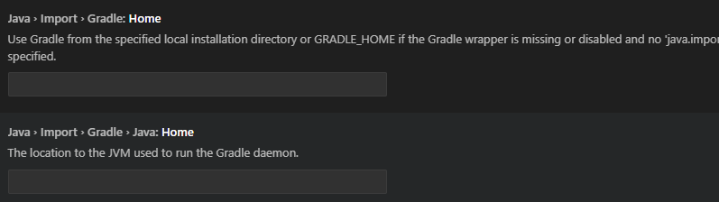

###### 20250401 April fool's day 푸하하 근데 안웃김 ㅡㅡ 
    > Java랑 Springboot 첫날 !!! 명건쌤이랑!!!
# java-springboot-2025
2025년 PKNU Java 개발자과정 SpringBoot 리포지토리 !!

### 20250401 첫수업 !! 음 ..전체적으로는 한 38..일..?
## 1일차

### 웹 개요
  > 이론을 너무 몰라도 안 된대!! 기본적인 개념은 숙지해두자~
  - 구성 3단계
    - 브라우저 (클라이언트/프론트엔드) : 사용자가 **요청**을 하고, 그 결과를 돌려 받는 파트
    - 서버(백엔드) : 사용자의 요청을 받아서 DB에서 데이터를 가져와 처리하고, 사용자에게 **응답**하는 파트
    - 데이터베이스 - 가장 중요한 데이터가 저장되어 있는 파트 !!
  > 요청을 하고, 응답을 받는 과정이 중요함 !!

### Spring Boot 개요
- Java : 컴퓨팅 세상 모든 곳에서 사용될 수 있는 언어가 되고자 개발됨
- 웹개발
    1. CGI(Common GateWay Interface) - HTTP 프로토콜에서 정적인 데이터만 전달할 수 있는 웹기술
    2. Servlet - CGI를 개선한 Java 웹기술. 동적웹을 개발할 수 있음
        - HTML 코드를 전부 Java에서 작성해야 함 (완전 어렵대)
    3. EJB(Enterprise Java Bean) - 서블릿으로 대형 프로젝트를 개발할 수 있는 Java 웹기술
        - **무 지 하 게** 복잡.
      > 위의 방법들은 다 좀 불편했대~
    4. JSP(Java Server Page) - 자바 코드와 웹페이지 코드를 분리하여 개발할 수 있는 Java 웹기술
        - 확장자가 .jsp / 스파게티 코드 ; 웹페이지와 자바코드가 섞여 있어 분리하기 어려움!!
    5. Spring -Java 웹개발의 전성기. ; 웹개발에 봄이 왔대~ 🌸
        - 웹페이지와 자바 영역 분리
        - *그치만 설정이 복잡.*
    6. Spring Boot - Spring의 단점을 최소화. 설정을 간결화.

- Spring Boot
    - Spring 기술을 그대로 사용(마이그레이션이 간단)
    - JPA 기술을 사용하면 ERD나 DB설계를 하지 않고도 손쉽게 DB를 생성. DB 연동도 쉬움!
    - Tomcat Webserver가 내장! (설치 필요 없음 !)
    - 서포트하는 기능 다수 존재(개발을 쉽게 도와줌!)
        > 테스트용 JUnit, 로그용 Log4J2 모두 포함 ; 설치 필요 없음 !
    - 프론트엔드를 다양하게 지원. JSP, **Thymeleaf** , Mustache 등
    - React, View.js 등의 자바스크립트 프론트엔드와 연계해서 풀스택 개발 가능
    - MVC(Model, View, Controller)로 영역을 분리. 각 부분별로 따로 개발

- MVC
    - View는 JSP 포함, Thymeleaf, Mustach, HTML 등등
    
     > 사용자가 웹브라우저에서 요청하면, Controller에서 그 요청을 받아 Model에 요청하고, Model이 DB에서 정보를 가져와 다시 Controller에 갖다 주면 그걸 View가 받아서 사용자에게 전달해 줌 !!

     > *웹이란 ? 
        인터넷에서 사용자의 요청(request)에 대한 서버의 응답(response)입니다 ~!*

### Spring Boot 개발환경 설정
- 필요 요소
    - Java, 개발툴, 데이터베이스

- Java
    - Java Runtime과 JDK(Java Developer Kit) 존재
        - Oracle 외에도 OpenJDK가 산재 !!
        - https://www.azul.com/downloads/?package=jdk#zulu
        - https://adoptium.net/
        - https://jdk.java.net/
    - Java 17버전 이상 설치 !!
        - https://www.oracle.com/kr/java/technologies/downloads/
        - jdk-17.0.13_windows-x64_bin.msi 다운로드

    > 설치할 때 경로를 생각해서 관리하자 !! ; 나중을 대비하는 것임~
      ; C\Dev\Lang\Java\jdk-17
    
    - 시스템정보(sysdm.cpl) 고급 > 환경변수 Path 설정
        - 새로만들기
            - JAVA_HOME
        - Path에 %JAVA_HOME%\bin 추가, 맨 위로 보내기 ; 그래야 제일 상위로 실행 됨 !!
    - powershell
        - java --version으로 확인 ; 17.0.13 LTS

- Visual Studio Code ; 무료예요~ ^^
    - 확장 설치 !! ; Java 검색
        - Extension Pack for Java 설치. Debuger for Java 등 총 7가지 확장 설치


### Java 기본 실행
- VS Code에서 명령팔레트 실행(Ctrl + Shift + p)
    - Java create
    1. build tool > Maven
    2. No ArchType 선택
    3. Group ID 입력(com.example)
    4. Artifact ID 입력(demo)
    5. 저장위치 결정

### Spring Boot 설정
- Visual Studio Code 확장 설치
    - Spring 검색
        - Spring Boot Extension Pack 설치 (추가 3개 확장 같이 설치됨 !!)
    - Gradle 검색
        - Gradle for Java 설치

### Spring Boot 기본 실행(Java 프로젝트)
- VS Code에서 명령팔레트 실행
    - Spring initializr : Create a Maven Project 선택
    - Specify Spring Boot version: 3.3.10 선택택
      > SNAPSHOT은 개발 중간 버전이래 !! / M2&M3가 안정된 버전.
    - Specify project language : Java
    - Input Group Id : 본인 아이디 입력 ; 하고 싶은 거 입력!! ; 폴더 이름이 될 것!!
    - Input Artifact Id : spring01
    - Specify packaging type : Jar(Java archive, 압축파일)
    - Specify Java version : 17
    - Choose dependencies : Selected 0 dependencies
    - 저장위치 선택
    - **새 창 열기** -Spring Boot 프로젝트가 루트 폴더가 된 개발환경
      > 실행은 spring boot dashboard에서 진행하는 게 좋다 !

- 실행방법
    - 코드 작성
    - Spring Boot Dashboard > Apps > 앱 실행(Run)

- 기초문법
    - [JAVA기초문법](./JAVA_BASIC.md)
    > cf ) TIOBE : 컴퓨터 언어가 쓰이는 순위통계
    - 기본, 변수, 자료형, 연산산자, 흐름제어, 


#### 20250402 Java, Spring boot 2일차 !!!! 총 43번째 수업이더라 헉!!!!!!!!!!! ㅇ0ㅇ
## 2일차
- 기초 문법 계속 !!
    - [JAVA기초문법](./JAVA_BASIC.md)
    - 흐름제어(반복문), 배열, 메서드, 객체/클래스, 상속

## 3일차
- 기초 문법 계속 !!!
    - [JAVA기초문법](./JAVA_BASIC.md)
    - 상속, 인터페이스, 예외처리, 제네릭, 컬렉션 프레임워크, 입출력
 
 ### Spring Boot Build Tool
 - 개요
    - 프로젝트 빌드 과정을 자동화시켜주는 도구 !!
    - 컴파일, 테스트, 패키징, 의존성 관리, 배포 등등 포함

- Maven 
    1. Java 프로젝트 기본 빌드 도구
    2. Maven Repository, https://mvnrepository.com/ 검색 가능능
    3. 빌드, 패키징(jar/war 파일 생성), 테스트 등을 한번의 명령으로  간편하게 처리
    4. **가장 큰 특징** : 외부 라이브러리 자동으로 다운로드 및 관리
    5. pom.xml(Project Object Model) 파일로 빌드 설정을 관리
        - 초기설정시 빠졌거나, 추가되어야 하면 xml 코딩으로 추가
    6. Vs Code 확장 중 Maven Dependency Explorer 등으로 확인

- Gradle
    1. 안드로이드용 오픈소스 빌드 도구
        > 장점을 결합해서 만들었대 !!
    2. Maven Repository를 같이 사용 !
    3. Maven의 3, 4번 특징을 그대로 가지고 있음 !
    4. build.gradle 파일 사용. Groovy 스크립트 지원
    5. 빌드 과정을 병렬처리, 캐싱사용으로 Maven보다 10~100배 정도 향상된 성능을 가짐!

     > 회사에서 Maven을 쓸지, Gradle을 쓸지 모른대~ 둘 다 잘 알아놓자 !

 ### Gradle 설정
 - **Gradle로 프로젝트가 제대로 동작하지 않을 때 !!! 참고 !!!!**
    - https://gradle.org/ 에서 gradle 다운로드
    - 설치 경로 확인, 설치
    - 시스템 등록정보 PATH 지정. GRADLE_HOME 사용

 ### Spring Boot 로그 설정
 - Spring Boot를 colorizing 해주는 기능
 - src/resources/application.properties

    ```shell
    spring.output.ansi.enabled=always
    ```
- 서버 재시작


## 4일차
- 기초문법 마무리
    - [JAVA기초문법](./JAVA_BASIC.md)
    - 제네릭, 컬렉션 프레임워크, 입출력, 람다식, 스트림API

- Spring Boot 시작
- Gradle 오류 해결방법
    - [Gradle](https://gradle.org/install/)
    - C:\Gradle 위치에 압축해제 ; binary only 받을 것 !!
    - sysdm.cpl 환경변수 GRADLE_HOME 경로 입력, 확인(JAVA_HOME과 동일)
     

    - VS Code 설정

    

    - Gradle Build Server : Enabled 기본 On -> Off
    

    - Gradle Home -> 환경변수 입력한 GRADLE_HOME의 경로 입력
    - Gradle Java Home -> 환경변수 JAVA_HOME의 경로 입력 !!!! 

    - VS Code 재시작 !!

## 5일차

## 6일차
